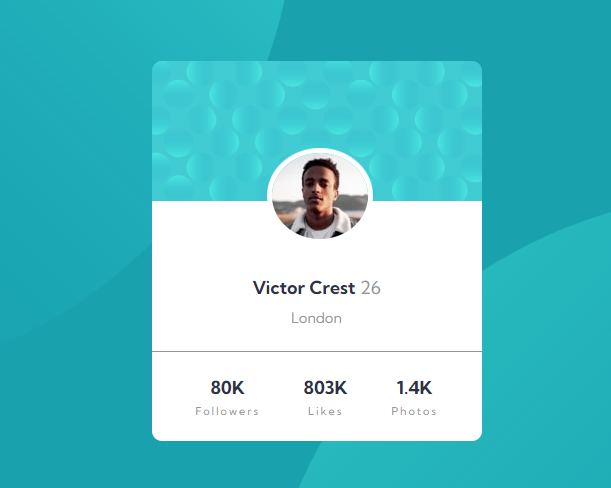

# Frontend Mentor - Profile card component solution

This is a solution to the [Profile card component challenge on Frontend Mentor](https://www.frontendmentor.io/challenges/profile-card-component-cfArpWshJ). Frontend Mentor challenges help you improve your coding skills by building realistic projects. 

## Table of contents

- [Overview](#overview)
  - [The challenge](#the-challenge)
  - [Screenshot](#screenshot)
  - [Links](#links)
- [My process](#my-process)
  - [Built with](#built-with)
  - [What I learned](#what-i-learned)
  - [Continued development](#continued-development)
  - [Useful resources](#useful-resources)
- [Author](#author)
- [Acknowledgments](#acknowledgments)

## Overview

### The challenge

This little project for beginners try to focus in basic designs to improve and apply knowledge of html and css.
Users should be able to:

- View the optimal layout depending on their device's screen size
- See hover and focus states for interactive elements

### Screenshot


### Links

- Solution URL: [Github](https://github.com/misaeljoelp/profile-with-statistics )
- Live Site URL: [Github pages](https://misaeljoelp.github.io/profile-with-statistics/)

## My process

### Built with

- Semantic HTML5 markup
- CSS custom properties
- Mobile-first workflow

### What I learned
How to use label figure to show images. 
Practice in css property position to ubicate an image.

To see how you can add code snippets, see below:

```html
    <figure class="bubbles"></figure>
    <figure class="photo"></figure>
```
```css
.card-container{
    position: relative;
}
.photo{
    position: absolute;
    top: 87px;
    left: 35%;
}

```
### Continued development

I would like practice more property position with major dificulties.

## Author

- Frontend Mentor - [@misaeljoelp](https://www.frontendmentor.io/profile/misaeljoelp)
- Twitter - [@MyJolyPeVa](https://www.twitter.com/MyJolyPeVa)


